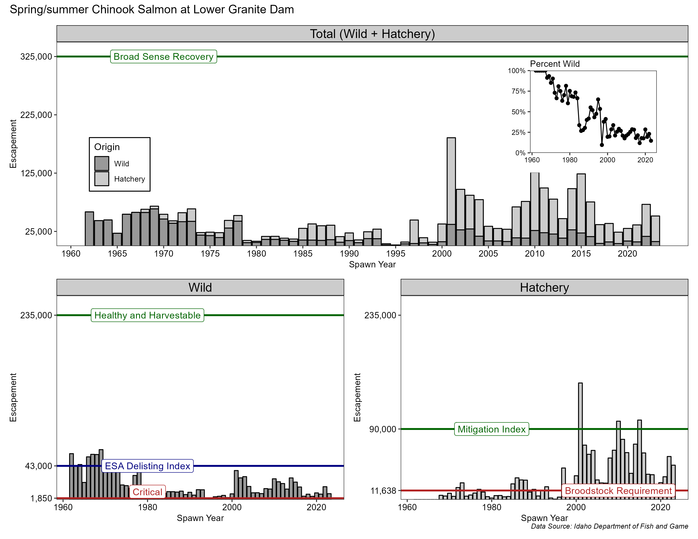
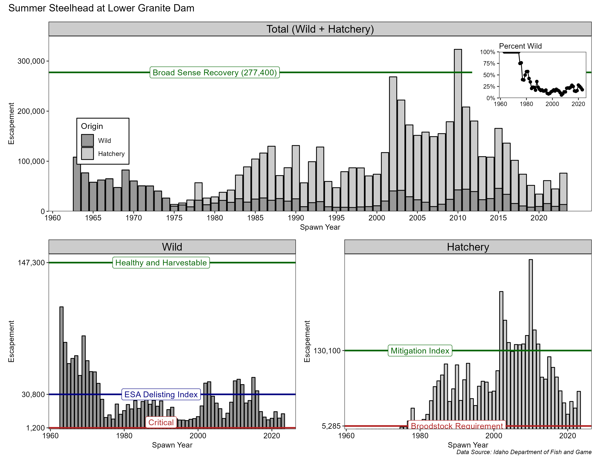
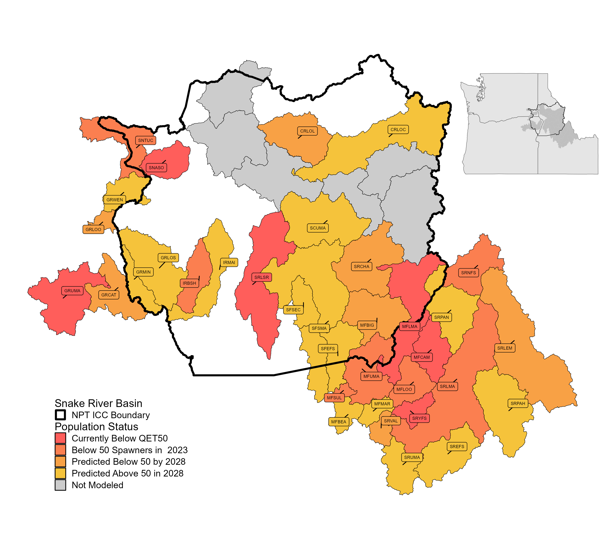
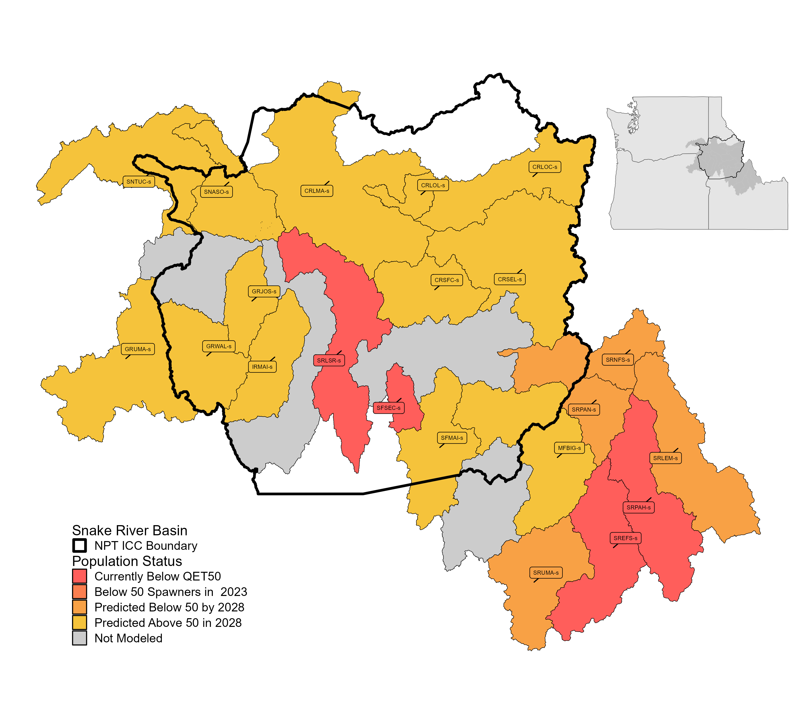
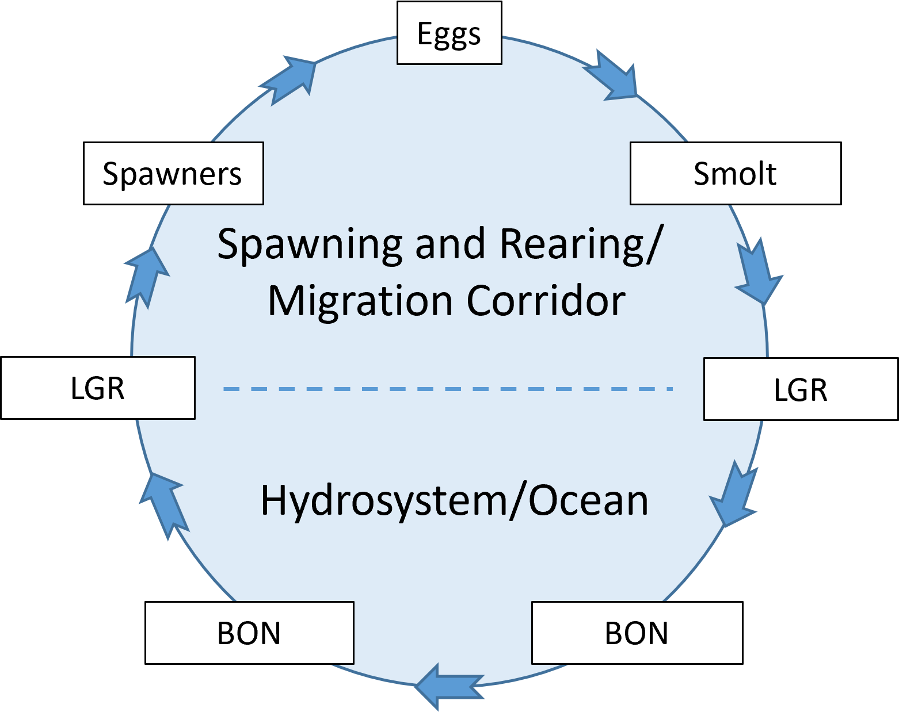
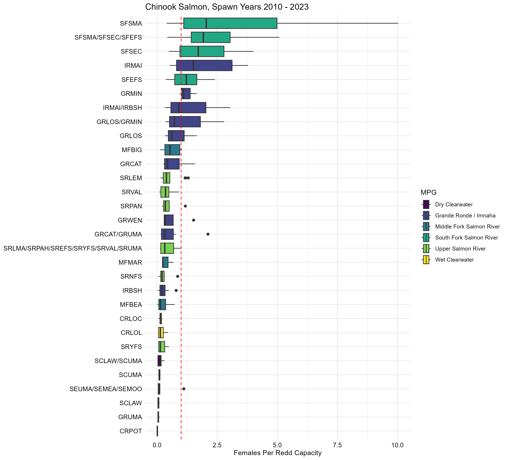
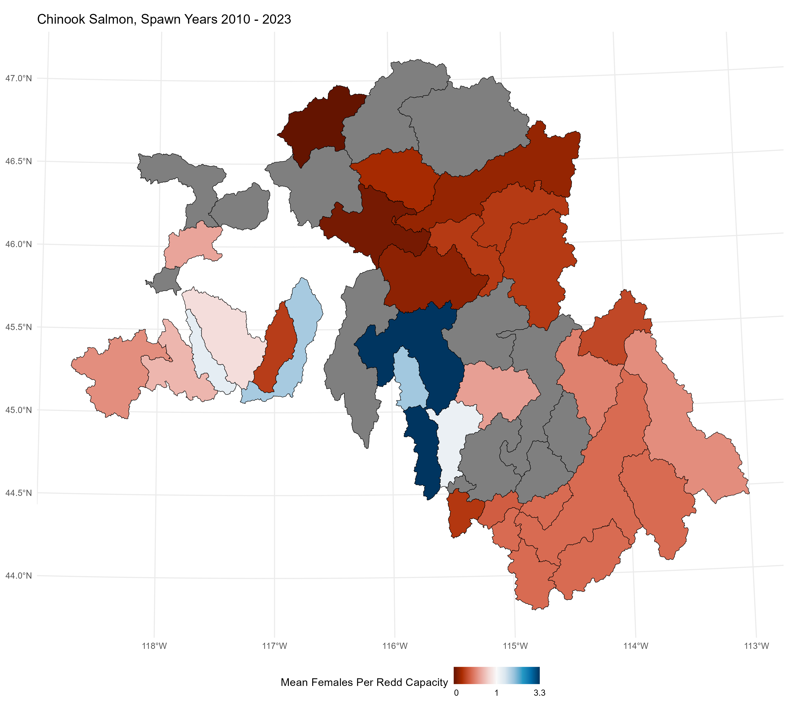
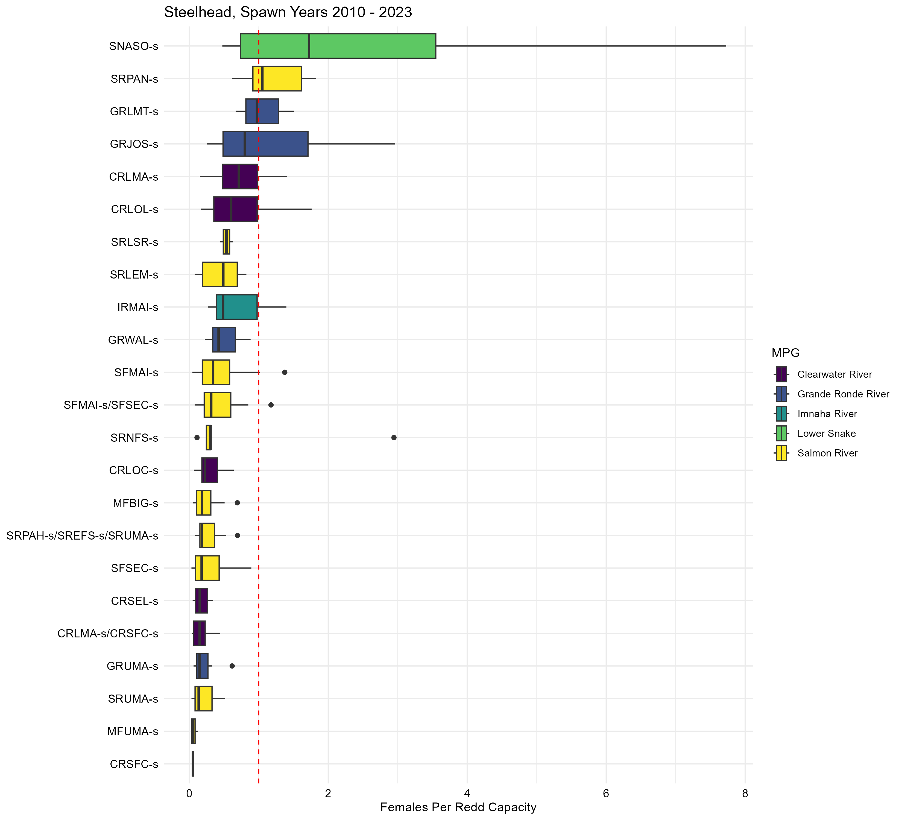
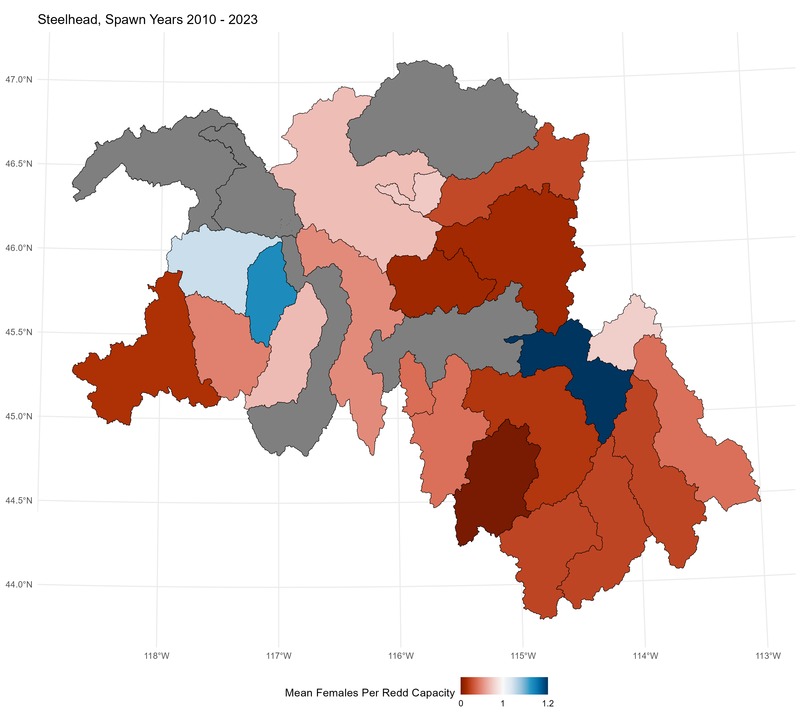

<!-- the following inserts the NPT logo into header and sets a watermark -->
```{=html}
<!-- <script> -->
<!--    $(document).ready(function() { -->
<!--      $head = $('#header'); -->
<!--      $head.prepend('') -->
<!--      $head.prepend('') -->
<!--    }); -->
<!-- </script> -->

<!-- <style> -->
<!-- p.caption { -->
<!--   font-size: 100%; -->
<!-- } -->
<!-- </style> -->


<div class="watermark">DRAFT</div>
```


```{r setup, echo = FALSE, message = FALSE}
# style.css - https://freerangestats.info/blog/2017/09/09/rmarkdown


knitr::opts_chunk$set(
  collapse = TRUE,
  warning = FALSE,
  message = FALSE,
  echo = FALSE,
  comment = "#>",
  fig.path = "../figures/",
  fig.width = 7,
  fig.height = 5,
  fig.align = 'center'
)

options(knitr.kable.NA = '--')

library(tidyverse)
library(knitr)
#library(kableExtra)
```

# Introduction

## Background

Fish have been a cornerstone of the Nez Perce Tribe people’s (Nimiipuu) cultural, spiritual, and physical well-being for millennia. Salmon, steelhead, and other aquatic resources are not only central to the Tribe's identity but also essential for sustaining their way of life. As stewards of their ancestral lands and waters, the Nimiipuu hold an inherent responsibility to protect and manage these fish runs to ensure their survival and abundance for future generations. This responsibility is reinforced by reserved treaty rights, which guarantee the Nez Perce Tribe access to their usual and accustomed fishing areas and the ability to co-manage these critical resources alongside state and federal agencies (**cite Treaties**).

Historically, the Columbia and Snake River Basins supported some of the largest fish runs in the world, with tens of millions of salmon and steelhead returning each year (**needs citation**). These fish runs were vital not only to Nimiipuu but also to the broader ecosystems and communities that depended on them. However, contemporary fish populations in these rivers have declined drastically due to habitat loss, overharvesting, climate change, and the construction of hydroelectric dams (**needs citation**). Many Snake River Basin salmonid populations are now listed under the Endangered Species Act (**needs citation**), requiring concerted efforts to prevent extinction and promote recovery. While significant challenges remain, the Nez Perce Tribe continues to lead efforts to restore these populations through innovative management and conservation practices.

The abundance, diversity, and distribution of Snake Basin salmon and other anadromous fish (e.g., steelhead, lamprey, sturgeon) are just a sliver of their historical condition. Less than half of the 117 historical populations remain, and contemporary returns of fish only account for 1-2% of the 2+ million historical abundances. Current natural-origin returns to the Snake River Basin are a subset of the Northwest Power and Conservation Council’s (NPCC) Fish and Wildlife Program abundance goal of 5 million by 2025, and a fraction of population-specific goals for healthy and harvestable as established by the Columbia Basin Partnership (CBP 2020) and adopted by the NPCC (Figures \@ref(fig:chn-lgr) and \@ref(fig:sth-lgr)). 

```{r chn-lgr, fig.width=11, fig.cap='Spring-summer Chinook salmon returns to Lower Granite Dam.'}

```

```{r sth-lgr, fig.cap='Steelhead returns to Lower Granite Dam.'}

```

In fact, spring/summer Chinook salmon and steelhead are on the brink of extinction. Wild spring/summer Chinook salmon adult returns to the Snake Basin from 2019 through 2023 averaged 8,764 fish with 17% (6 of 35 populations) of the monitored populations being at or below the Quasi-Extinction Threshold (QET) (Figure \@ref(fig:chn-qet)).  The QET is defined as 50 or fewer natural-origin fish on the spawning grounds for four consecutive years.  Of the six populations below the QET, all of them are already listed as “Threatened” under the Endangered Species Act (ESA). Returns in 2022 were 16,048 and slightly higher than the previous five years (2017-2021) and 2023, but still well below the abundance threshold for ESA-delisting (43,000) and far from the healthy and harvestable goal (235,000) for spring/summer Chinook in the Snake River basin (Figure \@ref(fig:chn-lgr)). The 2022 returns interrupted the steady downward decline, but that trend resumed again in 2023 with 37% of the populations having below 50 natural-origin spawners, and is predicted to be the same for 2024.  Conditions for salmon in the Snake River basin are not getting any better.   

```{r chn-qet, fig.cap='Snake River Basin spring/summer Chinook salmon population status relative to the quasi-extinction threshold (50 or fewer natural-origin fish on the spawning grounds for four consecutive years) and the Nez Perce Tribe Indian Claims Commission (ICC) boundary.'}

```

Wild steelhead returns to the Snake River Basin from 2019 through 2023 averaged 11,367 fish with 19% (4 of 21 populations) of the ESA-listed populations being at or below the QET (Figure \@ref(fig:sth-qet)). Returns of wild steelhead in 2023 were 13,631 fish, well below the abundance threshold for ESA-delisting (30,800) and the healthy and harvestable goal (147,300) for steelhead in the Snake River basin (Figure \@ref(fig:sth-lgr)).  

```{r sth-qet, fig.cap='Snake River Basin steelhead population status relative to the quasi-extinction threshold (50 or fewer natural-origin fish on the spawning grounds for four consecutive years) and the Nez Perce Tribe Indian Claims Commission (ICC) boundary.'}

```

If adult abundance continues to decline at a similar rate as the last 10 years, 57% of the remaining Snake River Basin spring/summer Chinook salmon populations and 38% of the steelhead populations are predicted to drop below 50 natural-origin spawners by 2028; and some populations (e.g., Tucannon spring Chinook salmon) will likely become extinct unless drastic measures are taken (NPT unpublished data). 

**Need Paragraph** - Given the recent trends in fish returns and the need for immediate and transformative changes to stop extinction.....NOAA interior rebuilding document, White House memo, report on disproportionate losses to Tribes, and CBRI.   

## Department of Fisheries Resources Management

The mission of the Department of Fisheries Resources Management (DFRM or department) is to "protect and restore aquatic resources and habitats" of all species for past, present, and future generations [@department_of_fisheries_resources_management_strategic_plan_ad_hoc_team_nez_2013]. The department’s vision is to achieve healthy and harvestable levels of all native anadromous and resident fish species within Nez Perce usual and accustomed areas. This vision is pursued by implementing actions that enhance fish survival, increase production, and improve habitat quality. The department comprises six divisions: Administration, Conservation Enforcement, Harvest, Production, Watershed, and Research. Each division is tasked with a distinct, yet interconnected, focus, necessitating a high degree of coordination across the department.

### Research Division

The Research Division (division) is tasked with monitoring and evaluating the status and trends of fish populations as well as the effectiveness of conservation actions. Using the best available science, the division provides accurate and comprehensive information to Nez Perce tribal members, co-managers, policy staff, and the broader public about the current and future states of Snake River Basin anadromous and resident fish populations. These insights inform adaptive management decisions to improve fish abundance and survival through the enhancement of hatchery programs, hydro-system operations, and habitat restoration efforts.

#### Previous Monitoring Efforts

In the past, the division was divided into independent research, monitoring, and evaluation (RM&E) projects each with a very specific and narrow focus on a single species and population (e.g., Imnaha River steelhead or Secesh River spring/summer Chinook salmon). And often, the project scope would further narrow and limit monitoring and evaluation efforts to a single life-stage or introduce contracting constraints that would limit our ability to share resources across projects to more effectively monitor all populations, species, and lifestages of fish important to the Nez Perce Tribe. Additionally, although project research questions and objectives were similar, the specific data collected, analysis approaches and life-stage metrics evaluated often differed across projects and geographic area. 

<!-- Historically, the division consisted of siloed projects focusing on a single species within a targeted geographic area. The division developed and fostered independent projects as regional needs arose and funding became available. Information gained under these projects was highly detailed, and often collected or analyzed using specialized methods to obtain the best possible results. Although these independent projects were previously justified, and successful at meeting objectives, the required intensity of monitoring often left data gaps for other species or geographic areas. -->

The independent development of project objectives often lead to a narrow monitoring strategy, that doesn't readily facilitate a basin-wide holistic approach which can more efficiently obtain regional co-manager and funding agency priorities.  Additionally, independent monitoring objectives achieved with varied methods deployed in small areas, for a single population or hatchery release group are often difficult or impossible to scale to larger geographic areas. For example, could project findings be compared across hatchery programs to improve our understanding of release group performance, or combined with other locations to increase statistical power in limiting factor and trend analyses, or could results be generalized to non-monitored areas? In most cases, fish managers are currently forced to make assumptions regarding project data collection and analysis methods, and the spatial and temporal comparability of data to answer these types of questions. Forcing managers to make assumptions regarding the trends observed throughout different datasets will lead to biased results, inaccurate uncertainties, and risks in the decision-making process. 

Working together throughout the last decade, co-managers and funding agencies recognized these shortcomings and started to focus on increasing the holistic knowledge of Snake River basin fisheries by identifying and filling information gaps, reducing project overlap, and establishing a set of commonly defined population indicators and metrics. In 2009, regional co-managers, regulatory, and funding agencies gathered for a workshop to develop a comprehensive Columbia Basin RME strategy (i.e., “Skamania Process”). During the workshop three main products were completed; 1) an Anadromous Salmonid Monitoring Strategy (ASMS), 2) Coordinated Assessments Data Exchange Standards and regional database, and 3) Fast-track proposals. The ASMS document identified a cost-effective way to meet the viable salmonid population (VSP) parameter monitoring and adaptive management information needs of the Northwest Power and Conservation Council’s (NPCC) Fish and Wildlife Program (FWP), ESA Recovery Plans, FCRPS BiOP, and of tribal, state and federal co-managers. Additionally, within the ASMS, monitored Snake River basin populations were identified as either requiring high- or low-precision monitoring to meet regional needs and justification for future funding. The data exchange standards provided project sponsors with consistent definitions of population indicators and metrics and a standardized data repository to better facilitate evaluations of status and trends. While the Fast-track proposals filled information gaps and provided funding for high-priority RME monitoring in populations identified during the development of the ASMS.

These previous efforts to unify monitoring and to share consistently defined VSP parameters have led to a greater understanding of Snake River basin fish population dynamics through congruent trend analyses and life-cycle modeling. However we have yet to implement a basin-wide strategy that avoids unnecessary assumptions during analyses and captures the correct uncertainty around governing population parameters when individual project information is combined across the landscape. Managers are still forced to assume datasets contained within standardized repositories are equal—when collection effort, methods, and bias within parameter estimates are known to exist.

#### New Comprehensive Monitoring Strategy

Beginning in 2025, the Research Division of the Nez Perce Tribe (NPT) Department of Fisheries Resources Management (DFRM) will implement a new fisheries monitoring strategy. This strategy was developed in response to the alarming decline of salmon and steelhead returns to the Snake River Basin (Figures \@ref(fig:chn-lgr) and \@ref(fig:sth-lgr)) and the priorities outlined by the Columbia Basin Restoration Initiative (CBRI). The CBRI facilitated contract reform for Bonneville Power Administration (BPA) Fish and Wildlife projects, enabling the consolidation of five BPA-funded division projects into a single, comprehensive initiative: **NPT Snake Basin Natural and Hatchery Salmonid Monitoring Project**. This unified project retains the monitoring and evaluation requirements of its predecessors while incorporating a more flexible framework that allows the division to address all salmonid species significant to the Nimiipuu.

Here we describe a new division-wide monitoring strategy with common goals and objectives to better inform and fill our portion the department's mission. Division goals are completed without sacrificing the ability to answer project specific questions. The framework described herein can easily facilitate the combination of datasets into integrated models that will improve our understanding of population dynamics and better evaluate hatchery and restoration program effectiveness across the Snake Basin.

#### Goals and Objectives

The new monitoring strategy emphasizes adaptability, increasing geographic coverage and shifting priorities as needed to support the department's mission of sustaining natural-origin fish populations at viable levels. These efforts aim to preserve genetic diversity across Snake River salmonid populations and to ensure anadromous fish remain on the landscape until the Lower Snake River Dams are breached. Additionally, the strategy seeks to enhance harvest opportunities for the Nimiipuu by contributing to fish population recovery and sustainable abundance.

Research Division goals include:

  1. Prevent the extinction of wild anadromous salmonids returning to Snake River Basin populations by implementing adaptive management recommendations informed by scientifically robust status and trends monitoring and collaborative efforts between DFRM divisions and co-managers.
  1. Enhance populations of natural anadromous species and increase sustainable harvest opportunities for Nez Perce Tribal members through adaptive management recommendations derived from action effectiveness monitoring and evaluation of hatchery and conservation actions.
  1. Support the recovery and resilience of native salmonid populations and their habitats by addressing environmental challenges, including climate change impacts, habitat degradation, and aquatic invasive species.
  
The objectives to achieve these goals are:

  1. Provide scientifically credible status and trends information for all anadromous species spawning and rearing in Snake River Basin tributaries within the Nez Perce Tribe's usual and accustomed areas.
  1. Monitor the availability, quantity, quality, and shifts in anadromous salmonid habitats resulting from climate change impacts, land use practices, and restoration activities and identify priority areas for future habitat protection, restoration, or enhancement.
  1. Detect and respond to predators and other aquatic invasive species that pose a threat to the recovery of native salmonid populations in Snake River Basin tributaries and collaboratively develop targeted strategies with co-managers to mitigate negative impacts.
  1. Provide adaptive management recommendations to improve the survival, productivity, and abundance of Snake River hatchery stocks, ensuring alignment with tribal harvest objectives and minimizing negative genetic, ecological, and competitive impacts of hatchery operations on wild populations.
  1. Recommend and support actions to improve the availability, connectivity, and quality of anadromous salmonid habitats within the Snake River Basin by identifying and addressing limiting factors; including, predators and other invasive species, barriers, and water quality issues.
  1. Facilitate the integration of monitoring data into decision-making frameworks to enhance conservation outcomes.
  1. Strengthen partnerships with regional co-managers and stakeholders to align efforts across jurisdictions and maximize the effectiveness of management and recovery actions.

To achieve our goals and objectives the monitoring strategy will comprises of two primary anadromous fish monitoring components. The first focuses on basin-wide status and trends monitoring of viable salmonid population (VSP) parameters, habitat and climate change metrics, and aquatic invasive and non-native predator species within the Indian Claims Commission (ICC) boundary (Figures \@ref(fig:chn-qet) and \@ref(fig:sth-qet). This comprehensive status and trends approach enables the division to assess life-stage performance across populations evaluated against critical population thesholds and provide early detection of limiting factors and potential threats. The second component focuses on action effectiveness monitoring and involves higher-resolution data collection in targeted areas to address research uncertainties and guide adaptive management of hatchery, habitat restoration, and conservation actions. Together, these two anadromous monitoring components assist the division in maximizing the effectiveness of the departments conservation actions in support of increased tribal harvest opportunities and salmonid population recovery.

Status and trends monitoring:

  * Viable salmonid population monitoring - basin-wide lower intensity monitoring, focus on estimating high level indicators and metrics from all populations using consistent and high precision methods
  * Stream habitat and climate change monitoring - base-wide low intensity monitoring, focus on tracking long-term shifts in habitat availability, quantity, and quality
  * Aquatic invasive species and predator monitoring - early detection and control, species distribution shifts
  
Action effectiveness monitoring:

  * Hatchery program evaluations - focus on in-hatchery performance and the comparisons across other hatchery programs and natural-origin populations for adaptive management
  * Habitat restoration and enhancement - relatively narrow objectives, focus on specific research questions and hypotheses
  
<!-- Division objectives were established to guide project tasks, and to encourage similar data collection and analysis approaches. Each objective explicitly states the division expectations, and are designed to focus efforts towards the integration of broad landscape data into large-scale (i.e., basin-wide) analyses to facilitate improved comparisons for decision making and adaptive management, while still answering project specific research questions. -->

# Anadromous Fish Monitoring

<!-- All Snake River natural populations and hatchery program releases were assigned to one of four monitoring tiers. Prioritization and assignment of each population and hatchery release group to a monitoring tier was based on existing project, co-management, and regional needs (e.g., ASMS proposed high precision and, or BPA tier I streams, management), and to make effective use of currently available data streams (e.g., current juvenile and adult monitoring locations, existing LSRCP monitoring, etc.). Each population and hatchery release group is non-randomly assigned to a monitoring tier to adequately capture the variation among and within groups, and to draw inference across the entire Snake River basin (including non-monitored populations). The five monitoring tiers are described as: -->

<!--   - Tier 1- High-precision life-cycle monitoring at the full population scale, -->
<!--   - Tier 2- High-precision adult only monitoring at the full population scale, -->
<!--   - Tier 3- Partial population adult monitoring expanded to full population, and -->
<!--   - Tier 4- No monitoring with modeled only information. -->

<!-- Across each tier, population, and hatchery release group a consistent monitoring method is used for each species to estimate similar stages within the life-cycle (steelhead - Figure 1; Chinook Salmon - Figure 2). Assignment of natural-origin steelhead populations to each monitoring tier is shown in Table 1 and Figure 3, and spring/summer Chinook Salmon monitoring assignments are shown in Table 2 and Figure 4. Tier 1 juvenile monitoring includes abundance, survival and life-history metrics calculated from data collected at rotary screw traps and hatchery PIT-tagging efforts for steelhead and spring/summer Chinook Salmon. Tier 1 and 2 monitoring of steelhead adult returns, kelts and repeat spawners is completed with the combined efforts of Lower Granite Dam adult sampling and PIT-tag observations throughout migratory corridors. Tier 1 and 2 adult spring/summer Chinook Salmon monitoring is completed with a mix of three methods; spawning ground surveys, weirs, and Lower Granite Dam adult sampling combined with PIT-tag observations. Tier 3 monitoring for steelhead includes deploying temporary instream PIT-tag detection systems (IPTDS) and weirs in tributaries following a probabilistic sampling design to estimate population metrics. Tier 3 monitoring for spring/summer Chinook Salmon includes the expanding spawning ground survey data to the full population using habitat characteristics and capacity models (e.g., NOAA’s intrinsic potential or Biomark ABS’s QRF capacity model). -->


## Status and Trends Monitoring

<!-- The objective of our new basin-wide monitoring is to continue, or establish new, time-series of HLIs for each species within each population by repurposing redundant monitoring efforts to areas with data gaps. -->

Three components to the division status and trends monitoring; viable salmonid population, stream habitat and climate change, aquatic invasive monitoring. And two components to our action effectiveness monitoring; hatchery program evaluations and habitat restoration and enhancement evaluations.

### Viable Salmonid Populaton Monitoring

*Need a paragraph* regarding the importance of VSP parameters (@mcelhany_viable_2000) to assess population status and trends. VSP parameters collectively provide a comprehensive assessment of population viability, helping to guide conservation and management efforts for salmonid populations. 

The focus of this effort is to effectively and efficiently obtain VSP parameters at each life stage for all anadromous species and populations within the ICC boundary. The collection of abundance, survival, and productivity metrics from adult and juvenile life stages will inform the development of life-cycle models. Efforts coordinated among co-managers will minimize effort and maximize effectiveness. The calculation of metrics can either be from direct data collection and estimation methods or through life-cycle modeling and solving for missing stages.


```{r life-cycle, fig.cap='Simple life-cycle of Snake Basin anadromous fish.'}

```

We will leverage the sampling at Lower Granite Dam and the instream PIT-tag detection systems (IPTDS) as our primary method to obtain adult metrics for VSP monitoring. Systematic sampling of spring/summer Chinook salmon and steelhead at Lower Granite Dam began in 2010. Fish sampling efforts include PIT-tagging, examinations for marks and injuries, genetic tissue collections, and scale collections which allow for accurate estimates of population abundance, female proportion, and age structure of natural-origin fish. Additionally, the method is a consistently applied across the basin and offers the most efficient approach to estimating adult VSP parameters of abundance, productivity, and diversity. We will also complete representative single pass spawning ground surveys (includes redd enumeration and carcass sampling) to obtain an index of abundance and  adult spatial distribution, proportion of hatchery origin spawners (pHOS), and prespawn mortality. In some cases, populations not covered by IPTDS, VSP monitoring will be completed with multiple pass spawning ground surveys or through data collection activities at hatchery brood stock collection weirs.

We will initiate two new data collection activities to monitor and obtain juvenile life-stage metrics for each population. The first activity includes the collection and PIT-tagging of juvenile parr through electro-fishing, seining, or minnow trapping efforts. The second activity will expand on the current infrastructure of adult IPTDS and will focus on deploying PIT-tag antennas that target migrating juveniles through natal tributary and mainstem river migration corridors. The combined juvenile monitoring methods will help determine the distribution, migration timing, and condition of fish rearing in each population, and their survival as they migrate through each stream reach. Juvenile abundance for VSP monitoring will be provided from a life-cycle modeling approach that seeks to calculate parr abundance from juvenile survival, smolt-to-adult return rates, and adult abundance (Appendix \@ref(juv-parr-abund)).

VSP parameters and the indicators and metrics provided from basin-wide adult and juvenile population monitoring will include:

  * Abundance
    * Escapement
    * Spawner abundance
    * Proportion of hatchery spawners (pHOS)
    * Cohort abundance (estimated from juvenile survival, SAR, and adult abundance)
  * Productivity
    * Adult-to-adult
    * Pre-spawn mortality
    * Cohort survival
    * Size and body condition
    * Parr (emigrant) per adult
    * Smolt-to-adult return rates
  * Diversity
    * Adult age composition
    * Run-timing
    * Sex ratio
    - Migration timing
    - Juvenile age class structure
  * Spatial distribution
    * Spawning locations
    * Species distribution
    * Rearing area occupancy

As an example, we propose using the data collection methods listed in Table \@ref(tab:secesh) to obtain VSP parameters for the South Fork Salmon River spring/summer Chinook salmon populations. Methods proposed for the remaining spring/summer and fall Chinook salmon, steelhead, and Coho salmon populations are shown in Appendix \@ref(pop-methods). Monitoring methods vary depending on existing operations and monitoring facilities (e.g., IPTDS, weirs, RSTs) as demonstrated by the Little Salmon River population in Table \@ref(tab:secesh). 

```{r pop-methods}
pop_methods <- readxl::read_excel('../data/population_methods.xlsx') %>%
  filter(Accessible) %>%
  filter(`ICC Boundary`)
```

```{r secesh-methods}
first_col <- 10
last_col <- dim(pop_methods)[2]

salmon_methods <- pop_methods %>%
  filter(MPG == 'South Fork Salmon River', #POP_NAME %in% c('Secesh River'),
         Species == 'Chinook Salmon')
```

  
```{r secesh, tab.cap = 'An example of base-level monitoring and data analysis methods to estimate high level indicators and metrics for Chinook salmon in the South Fork Salmon River major population group.'}
salmon_methods %>%
  select(POP_NAME, first_col:last_col) %>%
  pivot_longer(cols = -POP_NAME, names_to = 'Metric', values_to = 'Method') %>%
  pivot_wider(names_from = POP_NAME, values_from = Method) %>%
  #select(-Species, -POP_NAME) %>%
  kable()
```

### Stream Habitat and Climate Change Monitoring

Monitoring of shifts in stream habitat due to climate change and other land use practices will be important to make adaptive management recommendations and the prioritization of future restoration actions. Habitat surveys are intensive and require a large staffing effort to complete. Additionally, changes to stream environments are often minimal from one year to the next. As such, we will pursue habitat surveys in priority areas for each population every five years. Surveys will be conducted in index reaches to monitor trends and follow a statistical sampling design to allow inference across the entire population. In addition, a select number of index surveys n highly productive reaches will track long-term trends in core productivity areas of each population.

*Do the fish assemblage and species distribution surveys that NEOR folks complete fit into this section or the invasive/predatory monitoring?*

Habitat metrics that we will focus on collecting and monitoring include:

  * Physical habitat
    - Channel morphology
      - channel unit frequency
      - width-to-depth ratios
      - pool-to-riffle ratios
    - Riparian Vegetation
      - Shading and canopy density
      - Species composition
    - Connectivity
      - Barriers
  * Water quality and quantity
    - Streamflow
    - Stream temperature
    - Dissolved oxygen
    - pH
  * Macroinvertebrate
    - Diversity
    - Abundance
    - Pollution-sensitive

### Aquatic Invasive Species and Predator Monitoring

The spread of aquatic invasive species (AIS) and predators pose a significant threat to native fish populations, ecosystems, and hatchery operations within the Snake Basin. This monitoring plan outlines a proactive, science-based approach to detect, manage, and mitigate the impacts of AIS and predators. The goal is to protect critical habitats for native salmonids and support the Nez Perce Tribe's (NPT) conservation and recovery efforts by integrating best practices for monitoring and response. The divisions AIS and predator monitoring plan focuses on:

1. Early detection and rapid response (EDRR):
   - Identify and respond to AIS before they become established or spread widely.

1. Prevention and Education:
   - Monitor high-risk sites for introduction and provide outreach to prevent AIS spread.

1. Long-Term Management:
   - Track AIS trends over time to inform management actions and prioritize high-risk areas.

Invasive and predator species the division is targeting monitoring efforts towards includes:

* Invasive Mollusks
  - Zebra and Quagga Mussels (*Dreissena spp.*)
  - New Zealand Mudsnail (*Potamopyrgus antipodarum*)
  _ Golden Mussels (*Limnoperna fortunei*)
* Predatory Fish
  - Walleye (*Sander vitreus*)
  - Small-mouth Bass (*Micropterus dolomieu*)
  - Brook Trout (*Salvelinus fontinalis*)
  - Northern Pike (*Esox lucius*)
  - Northern Pikeminnow?????
* Avian Predators
  - Gulls
  - Double-crested Cormorants
  - Blue herons
  - American White Pelican (*Pelecanus erythrorhynchos*)

Primary sampling and monitoring will focus on areas with the highest potential for new introductions of AIS, including;

- high-risk waterbodies with significant human activity, recreational boating, or fishing,
- areas near and within hatchery facilities, intake and outflow areas, rearing ponds, and water diversions,
- critical spawning, rearing, and migration areas for native salmonids,
- predatory bird rookeries, haul-outs, and loathing areas.

AIS surveys will occur as needed, quarterly, or annually at high-risk sites for invasive species and less frequent to monitoring distribution shifts of predators. Invasive species surveys will include: 

- Visual Surveys:
  - Conduct regular inspections of substrates, vegetation, and equipment for AIS such as zebra/quagga mussels and New Zealand mudsnails.
- Environmental DNA (eDNA):
  - Use eDNA sampling to detect AIS presence/absence with high sensitivity.
  - Target species-specific DNA markers for priority invasive species.
- Trapping and Netting:
  - Deploy baited traps or nets to capture invasive aquatic animals like crayfish or non-native fish.
- Water Quality Testing:
  - Monitor nutrient levels, turbidity, and temperature, as they can indicate conditions favorable to AIS proliferation.
- Equipment Inspection:
  - Inspect and decontaminate monitoring equipment to prevent cross-contamination between sites.

Predator surveys to estimate impacts to native salmonids, abundance, and species distribution include:

  * Hook-and-line sampling
  * Gill netting
  * eDNA
  * Snorkel surveys (i.e., longitudinal species distribution surveys)
  * PIT tag scanning of predatory bird rookeries and loathing areas
  
By implementing this comprehensive AIS monitoring plan, the NPT can enhance its ability to protect native salmonid populations and critical habitats from invasive species threats.

<!-- - Prevention and Education -->
<!-- - Hatchery Biosecurity -->
<!--   - Enforce strict biosecurity protocols, including disinfection of equipment and water treatment. -->
<!--   - Develop contingency plans for AIS outbreaks near hatchery facilities. -->
<!-- -Public Outreach -->
<!--   - Collaborate with stakeholders to educate recreational users on AIS prevention (e.g., "Clean, Drain, Dry" campaigns). -->
<!--   - Provide signage and informational materials at high-risk waterbodies and boat ramps. -->

<!-- - Staff Training -->
<!--   - Train staff and collaborators in AIS identification, sampling techniques, and biosecurity measures.\ -->
<!-- - Rapid Response Framework -->
<!-- - Trigger Thresholds -->
<!--   - Establish thresholds for action (e.g., AIS detection in critical habitats or hatcheries). -->
<!-- - Response Teams -->
<!--   - Form dedicated teams for containment and eradication actions in the event of AIS detection. -->
<!-- - Mitigation Actions -->
<!--   - Apply site-specific mitigation strategies, such as localized eradication, chemical treatments, or barriers to limit AIS spread. -->
<!-- - Long-Term Monitoring and Reporting -->
<!-- - Trend Analysis -->
<!--   - Conduct annual reviews of AIS trends to evaluate the effectiveness of prevention and control efforts. -->
<!-- - Annual Reports -->
<!--   - Summarize monitoring results, trends, and management actions in an annual report shared with tribal leadership and regional partners. -->
<!-- - Plan Updates -->
<!--   - Periodically revise the monitoring plan based on new scientific research, emerging AIS threats, and lessons learned from implementation. -->


## Action Effectiveness Monitoring

The objective of the more intensive monitoring component of the division's new strategy focuses on collecting high-resolution data at specific locations to address key research uncertainties and support adaptive management. This targeted monitoring is designed to evaluate the effectiveness of hatchery programs, conservation measures, and restoration actions in achieving population recovery goals. By prioritizing areas with critical knowledge gaps or populations of particular concern, the division can refine management practices and understand the impact of conservation measures. This component also supports the development and testing of new methodologies, such as advanced tagging techniques, habitat assessments, and survival studies, which can be integrated into broader monitoring efforts. By maintaining flexibility in the scope and focus of intensive monitoring, the division ensures that its efforts remain responsive to emerging challenges and opportunities, ultimately contributing to the recovery and sustainability of salmonid populations across the Snake River Basin.

### Hatchery Program Evaluations

The department and division has a long-standing commitment to the management and evaluation of hatchery programs aimed at supporting the conservation and recovery of anadromous fish in the Snake Basin. Monitoring and evaluation (M&E) efforts for hatchery programs were guided by individual M&E plans (**cite JCAPE, NEOH, and NPTH M&E plans**), including commitments outlined in U.S. v. Oregon and annual operating plans. These efforts focus on ensuring that hatchery actions support sustainable fisheries adn broader conservation goals while avoiding potential impacts on wild/natural populations.

*Shane may need to mention something about Sockeye*

The division's hatchery evaluation strategy aims to guide and support hatchery actions to increase program effectiveness, maintain sustainable fisheries, and enhance conservation and recovery efforts for anadromous fish populations in the Snake Basin by integrating historical practices, new monitoring technologies, and lessons learned from previous hatchery evaluation programs (**cite JCAPE, NEOH, and NPTH M&E plans, Fall Chinook, Coho and Sockeye??**) in coordination with other Snake Basin hatchery programs (**cite Lower Snake River Compensation Plan and maybe others, Coho, Sockeye??**). The strategy establishes a framework for adaptive management to optimize hatchery performance, reduce ecological risks, and promote the sustainability of natural-origin populations.

The overarching goals are to increase life-stage survival and productivity, enhance sustainable harvest opportunities, and minimize adverse effects on natural-origin populations. Success will be evaluated through comparisons of key life-stage metrics against program production goals and through assessments of survival and productivity metrics between hatchery-origin and natural-origin fish.

Hatchery program production goals include:

  * Juvenile abundance and condition targets: Numbers and size of juveniles released
  * Adult escapement targets: Numbers of adults returning to hatchery traps, weirs, or spawning grounds.
  * Harvest availability: Fish available to support tribal, recreational, and commercial fisheries.
  * **should we include reintroduction programs, conservation, safety net programs here**

Program evaluations will examine similarities and differences across Snake Basin hatchery programs and between hatchery-origin and natural-origin fish, with a focus on metrics such as juvenile migration survival, smolt-to-adult return rates, and productivity. These evaluations will provide adaptive management recommendations to address issues related to fish husbandry, rearing conditions, or release practices, with the goal of optimizing hatchery program success.

Assessing the achievement of our goals will require comprehensive marking and tagging of hatchery release groups. Marking and tagging methodologies include:

  * Adipose fin clipping (ad-clipping): Applied to all or portions of release groups for origin identification during selective fisheries.
  * Parentage-based tagging (PBT): Applied to all release groups to complete run-reconstruction efforts
  * Coded wire tagging (CWT): A portion or all juveniles receive CWTs to aid in and complete run-reconstruction efforts.
  * PIT-tagging: Applied to release groups and natural-origin fish to evaluate juvenile and adult survival.

Marking and tagging efforts will adhere to commitments outlined in U.S. v. Oregon and annual operating plans, and are detailed in marking protocols provided in Appendix \@ref(hat-marking).

<!-- Our focus is to guide and support hatchery actions to increase program effectiveness, maintain sustainable fisheries, and to balance the benefits of artificial production with potential negative impacts to wild fish in order to better achieve the conservation and recovery of anadromous fish. -->

<!-- Future monitoring and evaluation of NPT hatchery programs will focus on evaluating success based on the achievement of individual production goals and comparisons of key life-stage metrics across Snake Basin hatchery programs and with release group natural-origin counterparts. Program production goals include abundance targets for juvenile release groups, adult escapement, and fish available for harvest. Evaluations across Snake Basin hatchery programs and with natural-origin counterparts will focus on similarities and differences between survival and productivity metrics. Completed evaluations will inform adaptive management recommendations and serve to identify problems related to fish husbandry or rearing conditions. -->

<!--   1. Evaluate hatchery program success by comparing life-stage metrics to the programs' production goals, across stocks and release groups, and to natural-origin counterparts. -->
<!--   1. Provide adaptive management recommendations to improve hatchery program success through higher life-stage survival and productivity, minimized negative effects on natural fish populations, and increased harvest opportunities. -->

<!-- Hatchery evaluations will require marking and tagging of release groups at different rates to better meet program goals. Marking will include ad-clipping a portion or all of the release group for origin determination in selective fisheries. Tagging includes parentage based tagging (PBT) of all spawned adults and coded wire tagging (CWT) of a portion or all juveniles released to assist in adult return run-reconstruction efforts, and PIT-tagging to conduct juvenile and adult survival studies. NPT hatchery program marking and tagging goals follow commitments made in US v OR and can be found Appendix \@ref(appendix:mark-tag) or in annual operating plans. -->


Data collection, marking, and tagging efforts will provide evaluation metrics for key phases of hatchery production, including spawning, rearing, and pre-release. Evaluations metrics of hatchery-origin fish will include:

  * Adult abundance: Counts of returning adults by origin.
  * Age composition: Age structure of returning adults.
  * Prespawn mortality: Mortality rates of adults before spawning.
  * Fecundity: Egg production per female.
  * Productivity: Spawner success rates.
  * Smolt-to-adult return rates (SARs): Survival rates from juvenile release to adult at a specific location (Lower Granite Dam or an adult trap).
  * Smolt-to-adult survival (SAS): Survival rates from juvenile to adult, including ocean and lower Columbia River harvest.
  * Fish growth and size: Growth metrics through hatchery rearing phases.
  * Rearing mortality: Mortality rates during hatchery phases.
  * Smolt migration survival and travel time:
    - Hatchery PIT-tagging
    - PIT-tagging of natural-origin fish at rotary screw traps

<!-- Program evaluations will use data collected during in-hatchery spawning, rearing, and pre-release periods and during PIT-tagging efforts of hatchery-origin and natural-origin fish. In-hatchery fish sampling occurs to track trends in fish size, growth, fecundity, and mortality through the various hatchery production phases (i.e., spawning, egg-to-fry, fry-to-smolt, smolt-to-release). Natural-origin fish are captured and PIT-tagged during the spring season at rotary screw traps to compare migration survival to hatchery counterparts. -->

<!-- Include a paragraph for rotary screw trap operations in Johnson Creek (2000 tags), Secesh River (2000 tags), Lolo Creek (4000 tags includes steelhead), and Imnaha River  (4500 tags includes steelhead) -->


### Habitat Restoration and Enhancement Monitoring

Habitat restoration and enhancement monitoring focus on key actions that we hypothesize will have a positive impact on fish survival and productivity. Monitoring for these actions follow detailed experimental design plans set-up to detect a specific response. For example, carcass outplants in the Clearwater Basin are ongoing and we seek to design a study to detect changes in fish size and survival...................

  * Secesh River Juvenile Survival and Mortality Monitoring
  * S.F. Clearwater River and Lolo Creek Nutrient Enhancement Studies
  * Wallowa and Lostine River Radio Telemetry Studies
  
# Resident Fish Monitoring

To be determined...point back to e-fishing for some information and targeted redd surveys for Bull trout. We could also make use of IPTDS to conduct movement and distribution analyses. Species composition monitoring as obtained from habitat and invasive species surveys.

# Education and Outreach

**Needs work** 

One important component of the DFRM 2013-2028 Management Plan’s (DFRM 2013) vision is to provide educational outreach to “ensure comprehensive knowledge of aquatic resource values and the future state of the resource for Nez Perce tribal members and the non-tribal public.” The Management Plan also outlines specific ‘social’ guiding principles related to employment and outreach. These guiding principles encourage the employment of tribal members and Native Americans (through tribal preference) “to support tribal participation in self-government, encourage tribal members to pursue higher education, and provide a pathway for members to administer matters that affect tribal life” while also supporting the U.S. Government’s trust obligation  to tribes. Furthermore, educational guiding principles are designed to foster “early and continual education (from Head Start through college and include social, cultural, and work experience) that encompasses and expands traditional knowledge as well as provides environmental and scientific knowledge” to promote tribal member recruitment into natural resource jobs and careers.

Enhance public awareness and knowledge of the value of healthy natural resources, and the need to maintain diverse, productive, and sustainable watersheds. 
with local conservation issues, resource concerns, and conservation needs, increasing community awareness of local natural resource conservation needs, to help encourage a conservation ethic within the community.

# Data Collection, Storage, Reporting and Dissemination

Identify the reporting mechanism for each…..

  * Evaluation Methods, Indicators and Metrics
    - Evaluation points obtained for each natural-origin population and hatchery-origin release group assigned to monitoring tiers is shown in Table 3. For each tier and evaluation group the indicators and metrics are estimated using similar datasets and analysis methods to allow more direct comparisons.
  * Data Collection and Analysis
    - General explanation and reference to protocols and methods for summarizing and analyzing raw data collected and explained above to estimate life-cycle stages showing Figures 1 and 2.
  * Integrated Modeling
    - Explain general model structure and how different datasets across the landscape will theoretically be combined for status and trends, life-cycle and population dynamic parameter estimates.


Effective data management is essential for ensuring the integrity, accessibility, and utility of information generated by the Nez Perce Tribe (NPT) hatchery monitoring and evaluation (M&E) programs. This plan outlines the framework for data collection, storage, quality assurance, and dissemination, following best practices to maximize data usability for adaptive management, reporting, and long-term conservation goals.

  * Continuous Improvement
    - Feedback Mechanism:
      - Solicit feedback from stakeholders, data users, and collaborators to refine data management practices.
      - Conduct periodic reviews of the data management plan to incorporate new technologies and methodologies.
    - Monitoring Compliance:
      - Assign a dedicated data manager to oversee compliance with data management protocols and ensure alignment with regional standards.

## Collection

  * Data Collection
    * Standards and Protocols:
      * Standardized Data Formats: Adopt regional standards (e.g., Pacific Northwest Aquatic Monitoring Partnership [PNAMP]) to ensure compatibility with external datasets.
      * Metadata Documentation: Include complete metadata with each dataset, describing collection methods, spatial and temporal coverage, variables, and units.
      * Automated and Manual Collection: Use a combination of automated technologies (e.g., PIT-tag detectors, environmental sensors) and manual field sampling (e.g., rotary screw traps, in-hatchery sampling).
    * Data Types:
      * Biological data: Metrics such as juvenile abundance, smolt migration survival, adult escapement, and fecundity.
      * Environmental data: Water temperature, flow rates, and habitat assessments.
      * Genetic data: Parentage-based tagging (PBT) and genetic stock identification (GSI).
- Use standardized forms to record AIS presence/absence, abundance, and habitat characteristics.
- Collect geospatial data (GPS coordinates) for all sampling locations.

  * Data Quality Assurance and Quality Control (QA/QC)
    - Standardized QA/QC Procedures:
      - Conduct field audits to verify the accuracy of data collection equipment and protocols.
      - Perform regular data validation checks to identify and correct inconsistencies or errors.
      - Use automated QA/QC tools for real-time flagging of outlier values or missing data.
    - Training and Documentation:
      - Provide annual training for field staff on data collection protocols and QA/QC standards.
      - Maintain detailed documentation of all QA/QC procedures to ensure consistency.

## Summaries and Analysis

<!-- Recent advancements in applied ecology and conservation include hierarchical integrated population models, which provide a unified analysis of raw count and demographic data to simultaneously estimate parameters regulating each population by sharing information with the “data poor” (i.e. missing data or non-available datasets). In comparison, the current approach evaluates single population response(s) by using independently estimated abundance and demographic metrics as inputs into life-cycle models to draw basin-wide inferences. The piecemeal approach can lead to biased conclusions regarding key processes (e.g., survival, productivity, density dependence), ignores valuable information contained in the raw data, and does not include a formal assessment of the variance and covariance within and between population parameters. Three major advantages exist between hierarchical integrated population models and conventional life-cycle analyses focusing on a single population. First, combining population data allows the estimation of all abundance and demographic metrics by “borrowing” from data-rich areas, thus, eliminating the need to collect data everywhere. Second, population indicators and metric estimates become more precise yielding greater statistical power to identify limiting factors or adaptive management solutions. And finally, all sources of uncertainty are adequately included and assigned to either the state or observational process, which allows fish managers to better understand potential risk in decision-making and true recovery/extinction potential.  -->

  * Data Analysis
    - Analytical Tools:
      - Use statistical and geospatial software (e.g., R, Python, GIS) for data analysis.
      - Incorporate regionally standardized analytical methods for metrics like smolt-to-adult return rates (SARs) and survival studies.
    - Interoperability:
      - Ensure data formats are compatible with external tools and systems to facilitate integration with regional and national analyses.

## Data Storage

  - Centralized Data Repository:
    - Maintain a centralized database for all hatchery M&E data. Use a secure, cloud-based platform that allows remote access for authorized users.
    - Ensure compatibility with regional databases such as PTAGIS (PIT Tag Information System) and StreamNet.
  - Backup Strategy:
    - Implement automated daily backups stored on secure, redundant servers.
    - Retain backups in multiple geographic locations to mitigate data loss risks.
  - Data Security:
    - Enforce role-based access controls (RBAC) to restrict access to sensitive data.
    - Regularly update software and security protocols to prevent unauthorized access.
  - Maintain data in a centralized repository compatible with regional databases like the Western Regional Panel on Aquatic Nuisance Species or USGS’s Nonindigenous Aquatic Species (NAS) database.
  * Long-Term Data Preservation
    - Archiving Strategy:
      - Archive finalized datasets and associated metadata in a secure, long-term storage system such as NOAA’s National Centers for Environmental Information (NCEI) or a tribal-managed repository.
    - Data Retention Policy:
      - Retain all raw data indefinitely for historical reference and trend analysis.
      - Periodically review and update archived datasets to ensure compatibility with current technologies.

- Share findings with regional partners, including state agencies, NOAA, and PNAMP, to improve coordination.

  * Data Sharing and Dissemination

  
## Reporting and Dissemination

### Data Accessibility

  - Accessibility:
    - Make non-sensitive data publicly available through regional data platforms (e.g., Data Stewardship for the Columbia Basin).
    - Share sensitive data with authorized users under controlled agreements to protect tribal interests and intellectual property.
  - Reporting:
    - Publish annual reports summarizing key findings and trends, including raw data where applicable.
    - Collaborate with regional partners to ensure data contributions support broader conservation and recovery efforts.
  - Community Engagement:
    - Develop data visualizations and dashboards to communicate results to tribal members and the public.
    - Incorporate traditional ecological knowledge (TEK) in data interpretation and dissemination.

### Annual Reports

### Adaptive Management Briefs

Need to build out this section by either stating the minimums of what we are going to do for each section (Status & Trends, Hatchery Effectiveness, etc.).Or put that detail under each section.  I want to ensure that the reporting is completed but more importantly the reporting that does occur is useful and provides data driven recommendations for advancement of DFRM goals and objectives. 

# Conclusion

The strategy described herein is meant to be updated as management needs and critical uncertainties arise. 

# References

<div id="refs"></div>

# (APPENDIX) Appendix {-}

# Population Methods {#pop-methods}

```{r spsm-methods, tab.cap='Field data collection methods to estimate high-level indicators and viable salmonid population parameters for Snake River spring/summer Chinook salmon.'}
pop_methods %>%
  filter(ESU_DPS == 'Snake River Spring/Summer-run Chinook Salmon ESU') %>%
  group_by(MPG) %>%
  mutate(MPG = ifelse(row_number() == 1, MPG, "")) %>%
  ungroup() %>%
  select(MPG, POP_NAME, first_col:last_col) %>%
  kable()
```

```{r sth-methods, tab.cap='Field data collection methods to estimate high-level indicators and viable salmonid population parameters for Snake River steelhead.'}
pop_methods %>%
  filter(ESU_DPS == 'Snake River Basin Steelhead DPS') %>%
  group_by(MPG) %>%
  mutate(MPG = ifelse(row_number() == 1, MPG, "")) %>%
  ungroup() %>%
  select(MPG, POP_NAME, first_col:last_col) %>%
  kable()
```

```{r fall-methods, tab.cap='Field data collection methods to estimate high-level indicators and viable salmonid population parameters for Snake River fall Chinook salmon.'}
pop_methods %>%
  filter(ESU_DPS == 'Snake River Fall-run Chinook Salmon ESU') %>%
  group_by(POP_NAME) %>%
  mutate(POP_NAME = ifelse(row_number() == 1, POP_NAME, "")) %>%
  ungroup() %>%
  select(POP_NAME, Subbasin, first_col:last_col) %>%
  kable()
```

```{r coho-methods, tab.cap='Field data collection methods to estimate high-level indicators and viable salmonid population parameters for Snake River Coho salmon.'}
pop_methods %>%
  filter(ESU_DPS == 'Snake River Fall-run Coho Salmon') %>%
  group_by(POP_NAME) %>%
  mutate(POP_NAME = ifelse(row_number() == 1, POP_NAME, "")) %>%
  ungroup() %>%
  select(POP_NAME, Subbasin, first_col:last_col) %>%
  kable()
```


# Habitat Capacity


```{r spsm-box, fig.cap='Ratio of occupied habitat versus available habitat for spring/summer Chinook salmon.'}

```

```{r spsm-map, fig.cap='Average ratio of occupied habitat versus available habitat for spring/summer Chinook salmon.'}

```


```{r sthd-box, fig.cap='Ratio of occupied habitat versus available habitat for steelhead.'}

```

```{r sthd-map, fig.cap='Average ratio of occupied habitat versus available habitat for steelhead.'}

```


# Hatchery Origin Adult Abundance

In-stream PIT-tag detections systems (IPTDS) and the dam adult branch occupancy model (DABOM) currently only estimate natural-origin spring/summer Chinook salmon and steelhead. The method works by systematically PIT-tagging natural-origin fish at Lower Granite Dam (LGD) and then expanding tag detections at each IPTDS by the detection detection efficiency and the tagging rate at LGD. Because hatchery-origin fish are not tagged at LGD their abundance estimates must be obtained with other techniques. Picket weirs are most often used to estimate hatchery-origin fish returning to an area, however, biologists can also use estimates of NOR abundance and the proportion of hatchery-origin spawners calculated from spawning ground survey data.


$$
pHOS = \frac{A^{HOR}}{(A^{NOR} + A^{HOR})}
$$

$$
A^{HOR} = \frac{(pHOS * A^{NOR})}{(1-pHOS)}
$$

# Juvenile Parr Abundance {#juv-parr-abund}

Fish managers in the Snake River basin typically estimate the abundance of juvenile anadromous salmonids leaving natal reaches using data collected at rotary screw traps. Screw traps became popular in the basin beginning in the early 1990's as an effective way to capture large numbers of outmigrating juveniles which allowed for efficient marking of individuals for survival studies and trap efficiency trials to estimate abundance. However, biologists and fish managers learned trap based estimates did not represent the full cohort of juveniles, only those juvenile which choose to migrate past the trap during it's operation. For example, abundance estimates obtained during the spring operation of a trap only represent fish migrating in the spring, as such, the estimated abundance is some unknown proportion (i.e., bias) of the total brood year abundance. The unknown bias from trap operations is further influenced by environmental cues (e.g., weather, moon phases) which drive migration timing, and changes how fish move past a trap, thus causing abundances from a consistent operational period to have variability in the bias--rendering an index of abundance even questionable. To make matters worse, the placement of a trap in the stream, relative to spawning and rearing areas will influence abundance estimates and make comparisons across streams difficult.      

in the past have been Abundance estimates are derived from mark-recapture estimates (@steinhorst_confidence_2004; @bonner_smoothing_2011). In general, the mark-recapture estimators used for juvenile abundance require four assumptions be met; 1) marks are not lost, 2) marked fish behave similarly to unmarked fish, 
 
 
Juvenile parr abundance is estimated from adult spawner abundance, conversion rates from LGR to the spawning areas, smolt-to-adult return rates, and juvenile cohort survival assuming they represent the population of interest.  

$$
Esc^{NOR}_{BY} =\sum_{a \in 3,4,5} \frac{A^{NOR}_{SY = BY + a,a}}{C_{SY}}
$$


$$
J^{NOR}_{BY} = \frac{Esc^{NOR}_{BY}}{(SAR_{BY} * S_{BY})}
$$


# Hatchery Release Groups {#hat-marking}

  * Spring/summer Chinook salmon
    * Johnson Creek
      - Release - 150,000
      - Marking
        - 100% PBT
        - 100% CWT
        - 0% Ad-clipped
      - PIT-Tagging
        - 2,000 hatchery-origin smolt
        - 2,000 Johnson Creek natural-origin smolt
        - 2,000 Secesh River natural-origin smolt
    * Lostine River
      - Release - **X**
      - Marking
        - 100% PBT
        - **X**% CWT
        - **X**% Ad-clipped
      - PIT-Tagging
        - **X** hatchery-origin smolt
        - **X** natural-origin smolt (tagged by Oregon Department of Fish and Wildlife)
    * Lolo Creek
      - Release - **X**
      - Marking
        - 100% PBT
        - **X**% CWT
        - **X**% Ad-clipped
      - PIT-Tagging
        - **X** hatchery-origin smolt
        - **4,000** natural-origin smolt (includes steelhead)
    * Clear Creek (onsite release at Kooskia Hatchery)
      - Marking
        - 100% PBT
        - **X**% CWT
        - **X**% Ad-clipped
      - PIT-Tagging
        - **X** hatchery-origin smolt
    * Nez Perce Tribal Hatchery (onsite release into Clearwater River)
      - Release - **X**
      - Marking
        - 100% PBT
        - **X**% CWT
        - **X**% Ad-clipped
      - PIT-Tagging
        - **X** hatchery-origin smolt
    * Dworshak Hatchery (onsite release into North Fork Clearwater River)
      - Marking
        - 100% PBT
        - **X**% CWT
        - **X**% Ad-clipped
      - PIT-Tagging
        - **X** hatchery-origin smolt

  * Fall Chinook salmon
    * Should list out each acclimation facility

  * Coho salmon
    * Lostine River
      - Marking
        - 100% PBT
        - **X**% CWT
        - **X**% Ad-clipped
      - PIT-Tagging
        - **X** hatchery-origin fish
    * Lapwai Creek
    * Clear Creek
  
  * Steelhead
    * Dworshak Hatchery (onsite release into North Fork Clearwater River)
      - Marking
        - 100% PBT
        - **X**% CWT
        - **X**% Ad-clipped
      - PIT-Tagging
        - **X** hatchery-origin smolt